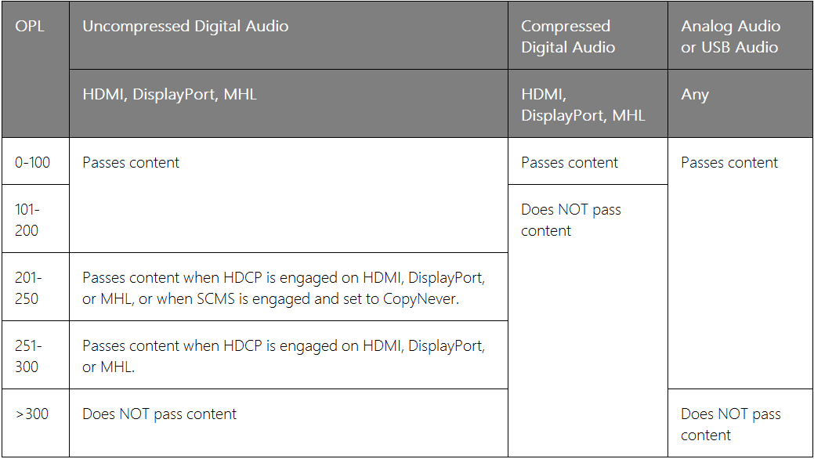
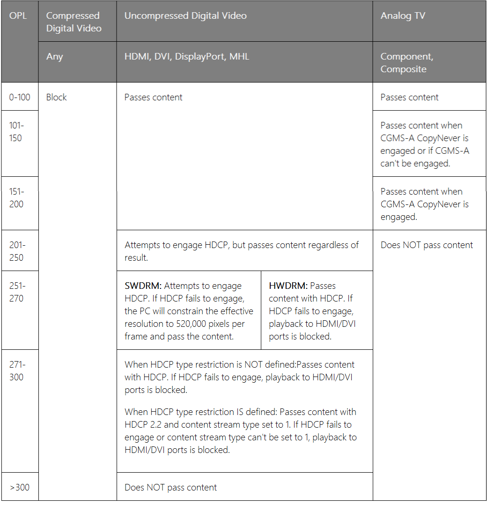

# Output Protection Levels

Output protection levels (OPLs) are described in detail in the [Compliance Rules for PlayReady Products](https://www.microsoft.com/playready/licensing/compliance/). This topic describes some of the general behavior of OPLs.

>[!NOTE]
> If this documentation differs from the language included in the [Licensing Agreements](https://www.microsoft.com/playready/licensing/), in the [Compliance Rules](https://www.microsoft.com/playready/licensing/compliance/) document or the [Robustness Rules](https://www.microsoft.com/playready/licensing/compliance/) document, those documents take precedence.

OPLs create layers of rights protection in order to associate types of content to a security restriction. Higher OPLs indicate a higher-level security. A device does not output content if the device only supports an output protection level that is lower than the minimum OPL for the content, because the device does not support the protected path requirements for playing back content protected at that level.

OPLs are associated to a particular type and format of content. For instance, compressed analog video, uncompressed analog video, compressed digital video, and uncompressed digital video all may have separate OPLs associated with them. Because each type of content format has a set of OPLs, different types of content may only have a few levels of protection associated with them.

The following table contains the allowed output protection levels for each type of content:

| Content Type| Allowed Values|
| --- | --- |
| Minimum Compressed Digital Audio| 100, 150, 200, 250, 300|
| Minimum Uncompressed Digital Audio| 100, 150, 200, 250, 300|
| Minimum Compressed Digital Video| 400, 500|
| Minimum Uncompressed Digital Video| 100, 250, 270, 300|
| Minimum Analog Television| 100, 150, 200|

The following tables outline the mappings between various OPLs in the PlayReady license and how PlayReady enforces them.

<!-- <table>
  <tr>
    <th class="tg-yw4l" align="center" rowspan="2">OPL</th>
    <th class="tg-yw4l">
      Uncompressed Digital Audio
    </th>
    <th class="tg-yw4l">Compressed Digital Audio</th>
    <th class="tg-yw4l">
      Analog Audio or USB Audio
    </th>
  </tr>
  <tr>
    <th class="tg-yw4l">HDMI, DisplayPort, MHL</th>
    <th class="tg-yw4l">HDMI, DisplayPort, MHL</th>
    <th class="tg-yw4l">Any</th>
  </tr>
  <tr>
    <td class="tg-yw4l">0-100</td>
    <td class="tg-yw4l" rowspan="2">Passes content</td>
    <td class="tg-yw4l">Passes content</td>
    <td class="tg-yw4l" rowspan="4">Passes content</td>
  </tr>
  <tr>
    <td class="tg-yw4l">101-200</td>
    <td class="tg-yw4l" rowspan="4">Does NOT pass content</td>
  </tr>
  <tr>
    <td class="tg-yw4l">201-250</td>
    <td class="tg-yw4l">
      Passes content when HDCP is engaged on HDMI, DisplayPort, or MHL, or when SCMS is engaged and set to CopyNever.
    </td>
  </tr>
  <tr>
    <td class="tg-yw4l">251-300</td>
    <td class="tg-yw4l">
      Passes content when HDCP is engaged on HDMI, DisplayPort, or MHL.
    </td>
  </tr>
  <tr>
    <td class="tg-yw4l">&gt;300</td>
    <td class="tg-yw4l">Does NOT pass content</td>
    <td class="tg-yw4l">Does NOT pass content</td>
  </tr>
</table> -->

<!-- <table>
  <tr>
    <th align="center" rowspan="2">OPL</th>
    <th>Compressed Digital Video</th>
    <th colspan="2">
      Uncompressed Digital Video
    </th>
    <th>Analog TV</th>
  </tr>
  <tr>
    <th>Any</th>
    <th colspan="2">HDMI, DVI, DisplayPort, MHL</th>
    <th>Component, Composite</th>
  </tr>
  <tr>
    <td>0-100</td>
    <td rowspan="7">Block</td>
    <td rowspan="3" colspan="2">Passes content</td>
    <td>Passes content</td>
  </tr>
  <tr>
    <td>101-150</td>
    <td>Passes content when CGMS-A CopyNever is engaged or if CGMS-A can't be engaged.</td>
  </tr>
  <tr>
    <td>151-200</td>
    <td>Passes content when CGMS-A CopyNever is engaged.</td>
  </tr>
  <tr>
    <td>201-250</td>
    <td colspan="2">
      Attempts to engage HDCP, but passes content regardless of result.
    </td>
    <td rowspan="4">Does NOT pass content</td>
  </tr>
  <tr>
    <td>251-270</td>
    <td>
      <b>SWDRM:</b> Attempts to engage HDCP. If HDCP fails to engage, the PC will constrain the effective resolution to 520,000 pixels per frame and pass the content.
    </td>
    <td>
      <b>HWDRM:</b> Passes content with HDCP. If HDCP fails to engage, playback to HDMI/DVI ports is blocked.</td>
  </tr>
  <tr>
    <td>271-300</td>
    <td colspan="2">
      

        When HDCP type restriction is NOT defined:Passes content with HDCP. If HDCP fails to engage, playback to HDMI/DVI ports is blocked.

      

        When HDCP type restriction IS defined: Passes content with HDCP 2.2 and content stream type set to 1. If HDCP fails to engage or content stream type can't be set to 1, playback to DMI/DVI  ports is blocked.
      

    </td>
  </tr>
  <tr>
    <td>&gt;300</td>
    <td colspan="2">Does NOT pass content</td>
  </tr>
</table> -->

To illustrate the concept of OPLs, consider the following scenario. A user named Mike has acquired content for playback on his set-top box that has an output protection level of 300 for uncompressed digital video output. When Mike connects his set-top box with an HDMI cable to an old TV that does not support HDCP, he cannot play the content. When Mike connects his set-top box with an HDMI cable to a new TV that supports HDCP, he is able to play the content. However, the HDCP protection on the HDMI cable ensures the device at the end of the HDMI cable is a legitimate TV, not a recorder that would record the content without authorization from the content owner.

See [Output Protection Levels for Windows 10](https://docs.microsoft.com/en-us/windows/uwp/audio-video-camera/playready-client-sdk#output-protection-levels) for information about how Windows 10 enforces Output Protection Levels. Like every PlayReady Client, it allows playback on the various outputs in the boundaries defined in the [Compliance Rules for PlayReady Products](https://www.microsoft.com/playready/licensing/compliance/).
