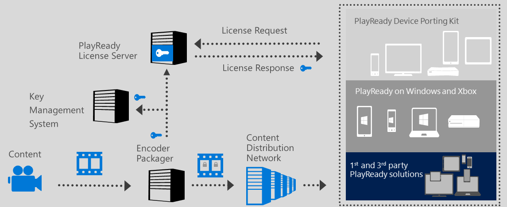
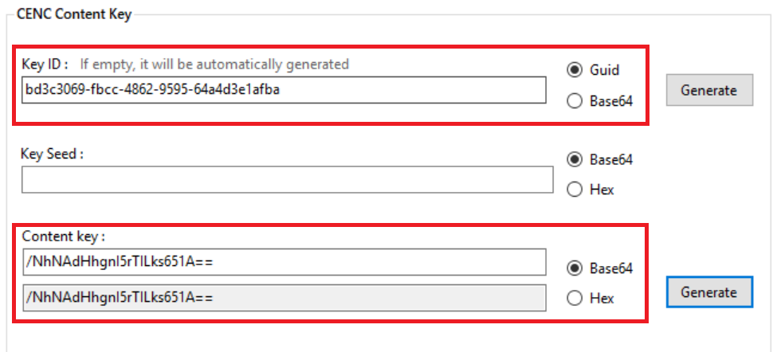
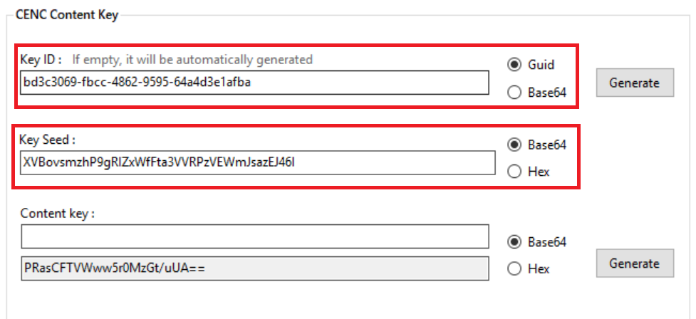

# Operating a PlayReady Packager

Note that operating a packager that provides PlayReady protection for content you want to protect:

* Does not require a licensing agreement from Microsoft.
* Does not bear any fees or royalty payments to Microsoft.

The following figure shows the overall view of how a PlayReady packager operates with other parts of the content delivery system.

* The packager is connected to a Key Management system to store the content encryption keys for each piece of content
* The packager receives clear content
* The packager outputs protected content

## Packaging and Client Policies

The packager only packages and protects the content. It does not set the policies that will be sent to clients by the PlayReady license server.

Once the content is protected, the service can define any set of PlayReady policies to be sent to any client independantly, by inserting them in the license generated for that particular client.
That means, the same piece of content, once protected, and identified as KID1, can be served to a client A with a certain set of playback policies (e.g. play on internal screen, up to the 4K resolution, for 48 hours maximum), while served to a client B with a different set of playback policies (e.g. play on internal and external screens, up to the 1080p resolution maximum, with no time limitation).

## Packager Configuration Interface

The packager typically provide configuration interface through a webpage, and through APIs. Here is a sample of the configuration interface for the packager built-in Azure Media Services:

For each piece of content to protect, you goind to input the KID and content encryption key with one of the following methods:

1) input the KID and Content Key

2) input the KID and Key Seed, and let the packager compute the Content Key

## See also
[PlayReady Test Server Content](http://test.playready.microsoft.com/)
